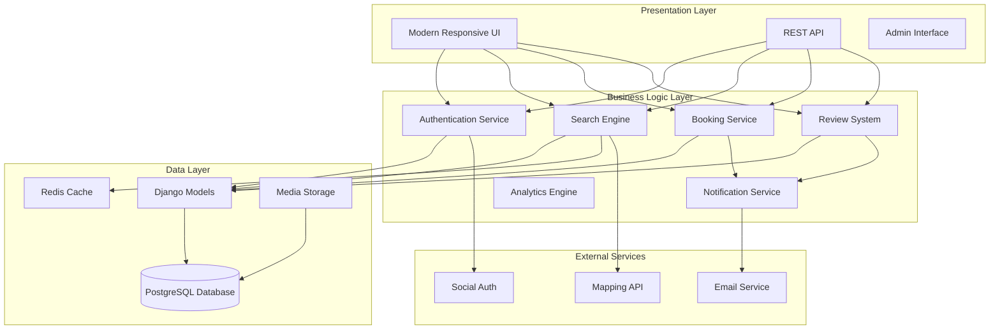
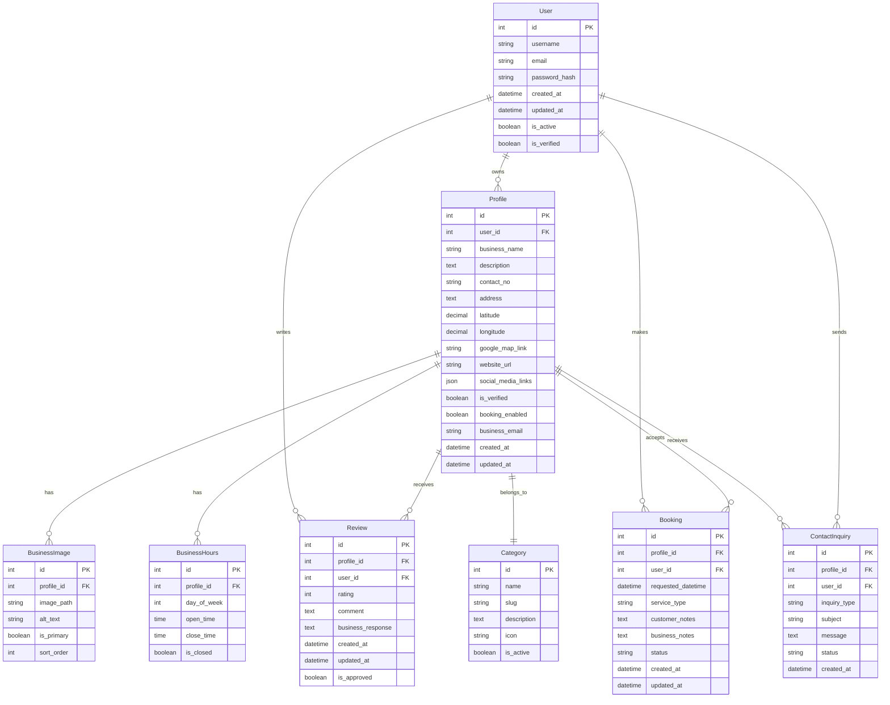

# Design Document: Business Directory Platform Upgrade

## Overview

This design document outlines the comprehensive upgrade of the existing Django business directory application into a modern, secure, and feature-rich platform. The upgrade transforms the current basic directory into a full-featured business discovery and engagement platform with advanced search capabilities, booking systems, review management, and modern API architecture.

The design follows Django best practices, implements security-first principles, and uses a modular architecture that supports scalability and maintainability. The platform will serve three primary user types: visitors discovering businesses, business owners managing their profiles, and administrators overseeing platform operations.

## Architecture

### High-Level Architecture

The upgraded platform follows a layered architecture pattern with clear separation of concerns:



### Technology Stack

**Backend Framework:**
- Django 5.1+ with security patches
- Django REST Framework for API endpoints
- Celery for background task processing
- Redis for caching and session storage

**Database:**
- PostgreSQL for primary data storage
- Full-text search capabilities
- Proper indexing strategy for performance

**Frontend Enhancement:**
- Modern CSS framework (Bootstrap 5 or Tailwind CSS)
- Progressive enhancement with vanilla JavaScript
- Responsive design principles

**Security & Performance:**
- Environment-based configuration management
- HTTPS enforcement with proper SSL/TLS configuration
- Database connection pooling
- Image optimization and CDN integration

## Components and Interfaces

### Core Models Architecture



### API Design

**RESTful API Endpoints:**

```
Authentication:
POST /api/auth/login/
POST /api/auth/logout/
POST /api/auth/register/
POST /api/auth/refresh/

Business Profiles:
GET /api/businesses/
POST /api/businesses/
GET /api/businesses/{id}/
PUT /api/businesses/{id}/
DELETE /api/businesses/{id}/
GET /api/businesses/search/

Categories:
GET /api/categories/
GET /api/categories/{slug}/businesses/

Reviews:
GET /api/businesses/{id}/reviews/
POST /api/businesses/{id}/reviews/
PUT /api/reviews/{id}/
DELETE /api/reviews/{id}/

Bookings:
GET /api/bookings/
POST /api/bookings/
GET /api/bookings/{id}/
PUT /api/bookings/{id}/
DELETE /api/bookings/{id}/

Contact:
POST /api/businesses/{id}/contact/
```

### Service Layer Architecture

**Search Service:**
- Implements full-text search using PostgreSQL's built-in capabilities
- Supports filtering by category, location, rating, and availability
- Provides autocomplete functionality for business names and categories
- Implements geospatial queries for location-based search

**Booking Service:**
- Manages appointment scheduling and availability
- Handles booking confirmations and notifications
- Implements calendar integration for business owners
- Supports different booking types and custom time slots

**Notification Service:**
- Manages email notifications for various events
- Implements in-app notification system
- Supports notification preferences and templates
- Handles bulk notifications and digest emails

**Review Service:**
- Manages review submission and moderation
- Calculates and caches average ratings
- Implements spam detection and content filtering
- Supports business responses to reviews

## Data Models

### Enhanced Profile Model

```python
class Profile(models.Model):
    user = models.OneToOneField(User, on_delete=models.CASCADE)
    business_name = models.CharField(max_length=200)
    description = models.TextField()
    contact_no = models.CharField(max_length=20)
    address = models.TextField()
    latitude = models.DecimalField(max_digits=10, decimal_places=8, null=True, blank=True)
    longitude = models.DecimalField(max_digits=11, decimal_places=8, null=True, blank=True)
    google_map_link = models.URLField(blank=True)
    website_url = models.URLField(blank=True)
    business_email = models.EmailField()
    social_media_links = models.JSONField(default=dict, blank=True)
    category = models.ForeignKey(Category, on_delete=models.PROTECT)
    is_verified = models.BooleanField(default=False)
    booking_enabled = models.BooleanField(default=False)
    average_rating = models.DecimalField(max_digits=3, decimal_places=2, default=0)
    total_reviews = models.PositiveIntegerField(default=0)
    view_count = models.PositiveIntegerField(default=0)
    created_at = models.DateTimeField(auto_now_add=True)
    updated_at = models.DateTimeField(auto_now=True)
    
    class Meta:
        indexes = [
            models.Index(fields=['category', 'is_verified']),
            models.Index(fields=['latitude', 'longitude']),
            models.Index(fields=['-average_rating']),
        ]
```

### Booking System Models

```python
class Booking(models.Model):
    STATUS_CHOICES = [
        ('pending', 'Pending'),
        ('confirmed', 'Confirmed'),
        ('cancelled', 'Cancelled'),
        ('completed', 'Completed'),
    ]
    
    profile = models.ForeignKey(Profile, on_delete=models.CASCADE)
    user = models.ForeignKey(User, on_delete=models.CASCADE)
    requested_datetime = models.DateTimeField()
    service_type = models.CharField(max_length=100)
    customer_notes = models.TextField(blank=True)
    business_notes = models.TextField(blank=True)
    status = models.CharField(max_length=20, choices=STATUS_CHOICES, default='pending')
    created_at = models.DateTimeField(auto_now_add=True)
    updated_at = models.DateTimeField(auto_now=True)
    
    class Meta:
        indexes = [
            models.Index(fields=['profile', 'status']),
            models.Index(fields=['user', 'status']),
            models.Index(fields=['requested_datetime']),
        ]
```

### Review System Models

```python
class Review(models.Model):
    profile = models.ForeignKey(Profile, on_delete=models.CASCADE, related_name='reviews')
    user = models.ForeignKey(User, on_delete=models.CASCADE)
    rating = models.PositiveSmallIntegerField(validators=[MinValueValidator(1), MaxValueValidator(5)])
    comment = models.TextField()
    business_response = models.TextField(blank=True)
    is_approved = models.BooleanField(default=True)
    created_at = models.DateTimeField(auto_now_add=True)
    updated_at = models.DateTimeField(auto_now=True)
    
    class Meta:
        unique_together = ['profile', 'user']
        indexes = [
            models.Index(fields=['profile', '-created_at']),
            models.Index(fields=['-rating']),
        ]
```

## Correctness Properties

*A property is a characteristic or behavior that should hold true across all valid executions of a system-essentially, a formal statement about what the system should do. Properties serve as the bridge between human-readable specifications and machine-verifiable correctness guarantees.*

After analyzing the acceptance criteria, I've identified the following properties that can be validated through property-based testing. These properties ensure the system behaves correctly across all valid inputs and scenarios.

### Property Reflection

Before defining the final properties, I've reviewed all testable criteria to eliminate redundancy:

- Search properties (3.1-3.6) can be consolidated into comprehensive search validation properties
- Review properties (5.1-5.7) cover distinct aspects and should remain separate
- Booking properties (10.1-10.8) each validate unique booking system behaviors
- Notification properties (7.1-7.6) each handle different notification scenarios
- Contact form properties (11.1-11.7) each validate different aspects of contact management

### Core System Properties

**Property 1: Input Validation Security**
*For any* user input containing potentially malicious content (SQL injection, XSS, script tags), the system should reject the input and maintain data integrity
**Validates: Requirements 1.5**

**Property 2: Pagination Consistency**
*For any* large result set, pagination should correctly divide results with consistent page sizes and no missing or duplicate items across pages
**Validates: Requirements 2.5**

### Search Engine Properties

**Property 3: Search Relevance**
*For any* search query, all returned businesses should contain the search terms in their name, category, or description fields
**Validates: Requirements 3.1**

**Property 4: Location Filter Accuracy**
*For any* geographic area filter, all returned businesses should have coordinates within the specified boundaries
**Validates: Requirements 3.2**

**Property 5: Search Result Sorting**
*For any* sort criteria (relevance, rating, distance), search results should be ordered correctly according to the specified criteria
**Validates: Requirements 3.3**

**Property 6: Autocomplete Relevance**
*For any* partial input string, autocomplete suggestions should match business names or categories that start with or contain the input
**Validates: Requirements 3.4**

**Property 7: Full-Text Search Coverage**
*For any* search term, full-text search should return businesses where the term appears in any searchable field
**Validates: Requirements 3.5**

**Property 8: Faceted Search Filtering**
*For any* combination of category and location filters, results should match all applied filter criteria
**Validates: Requirements 3.6**

### Business Profile Properties

**Property 9: Image Validation**
*For any* uploaded image file, the system should validate file type, size, and format before accepting the upload
**Validates: Requirements 4.1**

**Property 10: Business Hours Consistency**
*For any* business hours configuration, the system should correctly store and retrieve day-specific schedules with proper time validation
**Validates: Requirements 4.2**

**Property 11: Service Management**
*For any* service category or pricing information, the system should store and retrieve the data accurately with proper validation
**Validates: Requirements 4.3**

**Property 12: Social Media Link Validation**
*For any* social media URL, the system should validate the URL format and store it correctly in the profile
**Validates: Requirements 4.4**

**Property 13: Verification Status Management**
*For any* business profile, verification status changes should be tracked and displayed consistently
**Validates: Requirements 4.5**

**Property 14: Rich Text Processing**
*For any* rich text description, the system should store formatting correctly and sanitize potentially harmful content
**Validates: Requirements 4.6**

**Property 15: SEO URL Generation**
*For any* business profile, the system should generate SEO-friendly URLs that are unique and properly formatted
**Validates: Requirements 4.7**

### Review System Properties

**Property 16: Review Authentication**
*For any* review submission attempt, only authenticated users should be able to submit reviews
**Validates: Requirements 5.1**

**Property 17: Duplicate Review Prevention**
*For any* user-business combination, the system should prevent multiple reviews from the same user for the same business
**Validates: Requirements 5.2**

**Property 18: Rating Calculation Accuracy**
*For any* business with reviews, the average rating should be calculated correctly from all approved reviews
**Validates: Requirements 5.3**

**Property 19: Business Response Management**
*For any* review, business owners should be able to add, edit, or remove their responses
**Validates: Requirements 5.4**

**Property 20: Content Moderation**
*For any* review containing inappropriate content, the moderation system should flag it for admin review
**Validates: Requirements 5.5**

**Property 21: Review Display Information**
*For any* displayed review, it should include accurate timestamps and user information
**Validates: Requirements 5.6**

**Property 22: Review Sorting**
*For any* review list, sorting by helpfulness, date, or rating should order reviews correctly
**Validates: Requirements 5.7**

### Notification System Properties

**Property 23: Review Notification Delivery**
*For any* submitted review, the system should send email notifications to the corresponding business owner
**Validates: Requirements 7.1**

**Property 24: Welcome Email Delivery**
*For any* new user registration, the system should send a welcome email with account setup guidance
**Validates: Requirements 7.2**

**Property 25: In-App Notification Creation**
*For any* system event requiring notification, in-app notifications should be created and displayed to relevant users
**Validates: Requirements 7.3**

**Property 26: Notification Preference Respect**
*For any* user with configured notification preferences, the system should respect those preferences when sending notifications
**Validates: Requirements 7.4**

**Property 27: Digest Email Generation**
*For any* business with activity, periodic digest emails should be generated with accurate performance summaries
**Validates: Requirements 7.5**

**Property 28: Contact Form Spam Protection**
*For any* contact form submission, spam protection should detect and block malicious submissions while allowing legitimate messages
**Validates: Requirements 7.6**

### Analytics Properties

**Property 29: Profile View Tracking**
*For any* business profile view, the system should accurately increment the view count
**Validates: Requirements 8.1**

**Property 30: Search Analytics Tracking**
*For any* search query that leads to a profile view, the system should track the search-to-view conversion
**Validates: Requirements 8.2**

**Property 31: Performance Report Generation**
*For any* business owner, monthly performance reports should be generated with accurate data
**Validates: Requirements 8.3**

**Property 32: Engagement Metrics Tracking**
*For any* user engagement event (contact form, booking), the system should track the metrics accurately
**Validates: Requirements 8.4**

**Property 33: Conversion Tracking**
*For any* business inquiry or conversion event, the system should track and attribute it correctly
**Validates: Requirements 8.5**

**Property 34: Demographic Analytics**
*For any* profile visitor, demographic insights should be collected and aggregated accurately
**Validates: Requirements 8.6**

### Content Management Properties

**Property 35: Content Flagging**
*For any* reported inappropriate content, the system should flag it for admin review with proper categorization
**Validates: Requirements 9.1**

**Property 36: Admin Operations**
*For any* administrative action on user accounts or business profiles, the operation should be executed correctly with proper authorization
**Validates: Requirements 9.2**

**Property 37: Approval Workflow**
*For any* new business listing, the content approval workflow should process it according to defined rules
**Validates: Requirements 9.3**

**Property 38: Bulk Operations**
*For any* bulk content management task, all selected items should be processed correctly without data corruption
**Validates: Requirements 9.4**

**Property 39: Audit Logging**
*For any* administrative action, an audit log entry should be created with accurate details and timestamps
**Validates: Requirements 9.5**

**Property 40: Automated Content Filtering**
*For any* submitted content, automated filtering should detect and handle spam or inappropriate material
**Validates: Requirements 9.6**

### Booking System Properties

**Property 41: Booking Availability Calculation**
*For any* business with booking enabled, available time slots should be calculated correctly based on business hours and existing bookings
**Validates: Requirements 10.1**

**Property 42: Booking Creation**
*For any* selected time slot, booking requests should be created with complete customer details and proper validation
**Validates: Requirements 10.2**

**Property 43: Booking Confirmation Notifications**
*For any* created booking, confirmation emails should be sent to both customer and business owner
**Validates: Requirements 10.3**

**Property 44: Booking Status Management**
*For any* booking request, business owners should be able to accept, reject, or reschedule with proper status updates
**Validates: Requirements 10.4**

**Property 45: Calendar Integration**
*For any* booking operation, calendar integration should sync correctly with business owner schedules
**Validates: Requirements 10.5**

**Property 46: Booking Reminders**
*For any* confirmed booking, reminder notifications should be sent at appropriate times before the appointment
**Validates: Requirements 10.6**

**Property 47: Booking Modifications**
*For any* booking modification request (cancel/reschedule), the system should process it correctly with proper notice validation
**Validates: Requirements 10.7**

**Property 48: Booking Analytics**
*For any* booking activity, statistics should be tracked accurately for business analytics
**Validates: Requirements 10.8**

### Contact System Properties

**Property 49: Contact Form Email Delivery**
*For any* contact form submission, the message should be sent directly to the business owner's registered email address
**Validates: Requirements 11.1**

**Property 50: Email Address Validation**
*For any* business owner email address, the system should validate it before allowing contact form submissions
**Validates: Requirements 11.2**

**Property 51: Contact Form Rate Limiting**
*For any* contact form submission, spam protection and rate limiting should prevent abuse while allowing legitimate messages
**Validates: Requirements 11.3**

**Property 52: Contact Form Templates**
*For any* inquiry type, appropriate contact form templates should be provided and function correctly
**Validates: Requirements 11.4**

**Property 53: Contact Submission Tracking**
*For any* contact form submission, the system should track it accurately for business analytics
**Validates: Requirements 11.5**

**Property 54: Custom Email Configuration**
*For any* inquiry type, business owners should be able to set and use custom email addresses correctly
**Validates: Requirements 11.6**

**Property 55: Auto-Response Delivery**
*For any* contact form submission, auto-response emails should be sent immediately to acknowledge receipt
**Validates: Requirements 11.7**

### API Properties

**Property 56: API Data Accuracy**
*For any* API endpoint request, the returned data should be accurate and properly formatted according to the API specification
**Validates: Requirements 12.1**

**Property 57: API Security**
*For any* API request, authentication and rate limiting should be enforced correctly
**Validates: Requirements 12.2**

**Property 58: Mapping Integration**
*For any* location-based feature, mapping service integration should provide accurate geographic data
**Validates: Requirements 12.3**

**Property 59: Social Authentication**
*For any* social media login attempt, the authentication process should work correctly and securely
**Validates: Requirements 12.4**

**Property 60: Webhook Delivery**
*For any* webhook-triggering event, webhooks should be delivered correctly with proper payload and retry logic
**Validates: Requirements 12.5**

## Error Handling

### Error Categories and Responses

**Validation Errors:**
- Input validation failures return structured error messages
- Form validation errors highlight specific fields
- API validation errors return standardized error responses

**Authentication and Authorization Errors:**
- Unauthenticated requests redirect to login
- Unauthorized actions return 403 Forbidden responses
- Session expiration handled gracefully with re-authentication

**Business Logic Errors:**
- Booking conflicts handled with alternative suggestions
- Duplicate review attempts prevented with clear messaging
- File upload errors provide specific guidance

**External Service Errors:**
- Email service failures logged and retried
- Mapping service errors fall back to address display
- Social authentication failures provide alternative login options

**System Errors:**
- Database connection errors handled with graceful degradation
- File system errors logged and reported to administrators
- Unexpected errors logged with correlation IDs for debugging

### Error Recovery Strategies

**Graceful Degradation:**
- Search functionality continues without advanced features if services fail
- Profile display works without images if file storage is unavailable
- Basic functionality remains available during partial system failures

**Retry Mechanisms:**
- Email notifications retry with exponential backoff
- External API calls implement circuit breaker patterns
- Background tasks retry failed operations automatically

**User Communication:**
- Clear error messages explain what went wrong and next steps
- Progress indicators show system status during operations
- Maintenance mode displays informative messages during updates

## Testing Strategy

### Dual Testing Approach

The testing strategy implements both unit testing and property-based testing as complementary approaches:

**Unit Tests:**
- Test specific examples and edge cases
- Validate integration points between components
- Test error conditions and boundary values
- Focus on concrete scenarios and known use cases

**Property-Based Tests:**
- Validate universal properties across all inputs
- Test system behavior with randomized data
- Ensure correctness properties hold under all conditions
- Provide comprehensive input coverage through generation

### Property-Based Testing Configuration

**Testing Framework:** Hypothesis for Python/Django
- Minimum 100 iterations per property test
- Custom generators for business domain objects
- Shrinking enabled to find minimal failing examples

**Test Organization:**
- Each correctness property implemented as a single property-based test
- Tests tagged with feature name and property number
- Tag format: **Feature: business-directory-upgrade, Property {number}: {property_text}**

**Test Data Generation:**
- Smart generators that create realistic business data
- Constraint-based generation for valid input spaces
- Edge case generation for boundary conditions

### Testing Coverage Requirements

**Functional Coverage:**
- All API endpoints tested with property-based tests
- All business logic validated through properties
- All user workflows covered by integration tests

**Security Testing:**
- Input validation tested with malicious payloads
- Authentication and authorization tested comprehensively
- SQL injection and XSS prevention validated

**Performance Testing:**
- Database query performance validated
- API response time requirements tested
- Concurrent user scenarios validated

**Compatibility Testing:**
- Cross-browser compatibility for UI components
- Mobile responsiveness validated
- API compatibility across versions maintained

Now I need to use the prework tool to analyze the acceptance criteria before writing the correctness properties:

<function_calls>
<invoke name="prework">
<parameter name="featureName">business-directory-upgrade